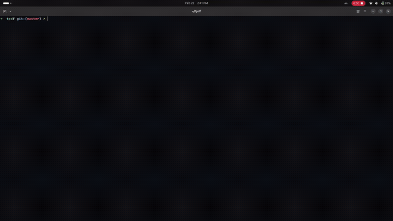

```
  _                _  __
 | |_ _ __   __ _ | |/ _|
 | __| '_ \ / _` || | |_
 | |_| |_) | (_| || |  _|
  \__| .__/ \__,_||_|_|
     |_|
```

[](https://github.com/IWhitebird/tpdf/actions/workflows/ci.yml)
[](LICENSE)

A fast terminal PDF viewer.



## Supported Terminals

tpdf requires a terminal with a graphics protocol. It auto-detects the best available protocol at startup.

| Terminal | Protocol | Support |
|---|---|:---:|
| Kitty | Kitty graphics | ✅ |
| WezTerm | Kitty graphics | ✅ |
| iTerm2 | iTerm2 inline images | ✅ |
| Ghostty | Kitty graphics | ✅ |
| foot | Sixel | ✅ |
| Konsole | Sixel | ✅ |
| contour | Sixel | ✅ |
| mlterm | Sixel | ✅ |
| xterm (with `-ti 340`) | Sixel | ✅ |
| tmux | Passthrough | ⚠️ |
| Alacritty | None | ❌ |
| Windows Terminal | None | ❌ |
| macOS Terminal.app | None | ❌ |
| GNOME Terminal | None | ❌ |

## Installation

```sh
curl -fsSL https://raw.githubusercontent.com/IWhitebird/tpdf/master/install.sh | bash
```

### Other methods

**Download manually** — grab the latest binary from [Releases](../../releases/latest):

```sh
tar xzf tpdf-*.tar.gz
sudo mv tpdf /usr/local/bin/
```

**Build from source** (requires Rust toolchain + `libfontconfig1-dev`):

```sh
git clone https://github.com/IWhitebird/tpdf.git
cd tpdf
cargo build --release
sudo cp target/release/tpdf /usr/local/bin/
```

## Usage

```
tpdf [OPTIONS] [PATH] [COMMAND]
```

```
Arguments:
  [PATH]  Path to PDF file

Commands:
  update  Update tpdf to the latest version

Options:
  -n, --night           Start in night mode
  -f, --fullscreen      Start in fullscreen
  -p, --page <N>        Start at page number
  -d, --layout <1|2|3>  Layout: 1 (single), 2 (dual), 3 (triple)
  -h, --help            Print help
  -V, --version         Print version
```

## Keybindings

| Key | Action |
|---|---|
| `h` / `l` | Previous / next page |
| `j` / `k` | Pan down / up (when zoomed) |
| `H` / `L` | Pan left / right (when zoomed) |
| `+` / `-` | Zoom in / out |
| `0` | Reset zoom |
| `d` | Cycle layout (1-up / 2-up / 3-up) |
| `n` | Toggle night mode |
| `f` | Toggle fullscreen |
| `p` | Go to page |
| `g` / `G` | First / last page |
| `q` | Quit |

## Roadmap

More features coming soon!

- Text mode for terminals that don't support graphics protocols
- Text search within PDFs
- Table of contents / outline navigation
- Bookmark support
- Copy text to clipboard
- Mouse support (scroll, click to pan)
- Custom color themes
- PDF form viewing
- Continuous scroll mode

## License

GPL-3.0
